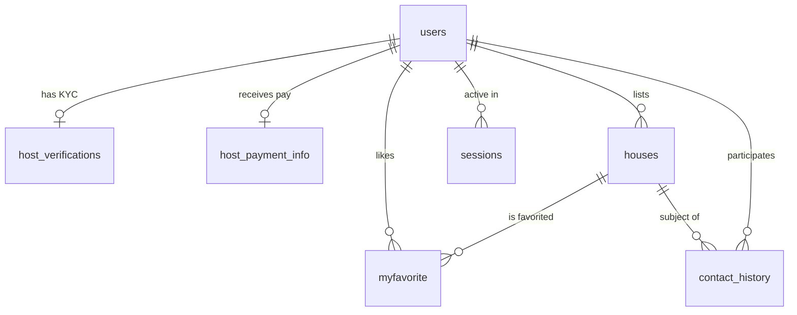

# 🏠 HouseRent Platform

A modern, full-stack house renting platform that connects property hosts with potential renters. Built with **FastAPI** (Python) and **PostgreSQL**, featuring real-time messaging, secure authentication, multi-step host onboarding, image uploads, and a polished dark UI.

<div align="center">


[Features](#-features) • [Quick Start](#-quick-start) • [Project Structure](#-project-structure) • [Database Schema](#-database-schema) • [API Docs](#-api-documentation)

</div>

---

## ✨ Features

### For Renters

- 🔍 **Browse Listings** — Filter properties by category (Hotel, House, Hostel)
- ⭐ **Save Favourites** — Bookmark properties you're interested in
- 💬 **Real-time Messaging** — Chat directly with hosts via Socket.IO
- 🖼️ **Image Slider** — View multiple property photos with swipe support
- 📱 **Responsive Design** — Seamless experience across all devices
- 💡 **Rental Tips** — Helpful guides for first-time renters

### For Hosts

- 🪜 **6-Step Onboarding** — Guided verification flow (Info → Identity → Property → Listing → Payment → Terms)
- 📤 **Multi-image Upload** — Add multiple photos per listing with drag & drop
- 🗺️ **Map Integration** — Pin exact property location with Leaflet.js
- 📊 **Host Dashboard** — Manage all your listings in one place
- 🔐 **KYC Verification** — ID + selfie + property document upload

### Platform Features

- 🔐 **Secure Auth** — UUID session-based login with cookie management
- 📧 **Email Verification** — Token-based email confirmation via SMTP
- 💳 **Payment Info** — Encrypted bank account storage (Fernet)
- 🔴 **Redis Messaging** — Persistent chat message storage
- 🎨 **Dark Midnight UI** — Cohesive design system across all pages

---

## 🛠️ Tech Stack

| Component             | Technology                       |
| --------------------- | -------------------------------- |
| **Backend**           | FastAPI 0.109.2 (Python 3.12)    |
| **Database**          | PostgreSQL 15                    |
| **Cache / Messaging** | Redis 7                          |
| **Real-time**         | Socket.IO (python-socketio)      |
| **Authentication**    | UUID sessions + secure cookies   |
| **File Storage**      | Local filesystem (Docker volume) |
| **Frontend**          | HTML5, CSS3, Vanilla JS, Jinja2  |
| **Maps**              | Leaflet.js                       |
| **Encryption**        | Fernet (cryptography library)    |
| **Deployment**        | Docker + Docker Compose          |

---

## 📁 Project Structure

```
finalProject/
├── backend/
│   ├── app/
│   │   ├── main.py                     # App entry point — registers all routers
│   │   ├── config.py                   # FastAPI + Socket.IO + DB + Redis setup
│   │   ├── routers/
│   │   │   ├── auth.py                 # Register, login, logout
│   │   │   ├── home.py                 # Home page, house detail, search API
│   │   │   ├── hoster.py               # Property upload & management
│   │   │   ├── become_host.py          # 6-step host onboarding + email verification
│   │   │   ├── contact.py              # Chat room creation & messaging
│   │   │   ├── favorites.py            # Save / remove favourites
│   │   │   ├── profile.py              # User profile page
│   │   │   └── more.py                 # About, FAQ, Terms, Rental Tips
│   │   ├── services/
│   │   │   ├── user_service.py         # get_user_data, send_email, encryption
│   │   │   ├── contact_services.py     # Unique room code generation
│   │   │   ├── redis_db.py             # Redis message read/write
│   │   │   └── Hash_password.py        # Password hashing with salt
│   │   └── events/
│   │       └── contact_events.py       # Socket.IO event handlers
│   ├── static/
│   │   ├── uploads/                    # House listing images
│   │   └── hosters-info/               # KYC documents (ID, selfie, proof)
│   ├── requirements.txt
│   └── .env                            # Environment variables (not in git)
│
├── frontend/
│   ├── base.html                       # Base template (navbar, footer)
│   ├── home.html                       # Listings grid with category filter
│   ├── house.html                      # House detail + image slider
│   ├── host.html                       # Property upload form + map
│   ├── contact.html                    # Real-time chat interface
│   ├── step1.html – step6.html         # Host onboarding steps
│   ├── login.html / register.html      # Auth pages
│   ├── myprofile.html                  # User profile
│   ├── favorites.html                  # Saved properties
│   ├── pending.html                    # Awaiting host approval
│   ├── aboutUs.html / aboutMe.html     # Info pages
│   ├── rentalTips.html                 # Renter guides
│   ├── termsAndConditions.html         # Legal page
│   ├── uploadSucsess.html              # Post-upload confirmation
│   ├── css/                            # Per-page stylesheets
│   ├── script/                         # Per-page JavaScript
│   └── imgs/                           # Static assets
│
├── docs/
│   └── screenshots/                    # home.png, host.png, login.png, register.png
├── database_shema.md                   # Full DB schema documentation
├── docker-compose.yml
├── Dockerfile
└── README.md
```

---

## 📊 Database Schema

### Tables Overview

| Table                | Purpose                                                  |
| -------------------- | -------------------------------------------------------- |
| `users`              | Accounts, auth credentials, verification flags           |
| `houses`             | Property listings with `img_url TEXT[]` and JSON details |
| `host_verifications` | KYC documents (ID photos, selfie, proof of ownership)    |
| `host_payment_info`  | Encrypted bank account details                           |
| `sessions`           | UUID-based sessions with expiry                          |
| `myfavorite`         | User ↔ house bookmarks junction table                    |
| `contact_history`    | Chat rooms between renters and hosts                     |
| `user_data`          | JSONB browsing history                                   |

> See [`database_shema.md`](database_shema.md) for the complete schema, column definitions, and full setup SQL.

### Entity Relationships


```mermaid
erDiagram
    users ||--o| host_verifications : "has KYC"
    users ||--o| host_payment_info : "receives pay"
    users ||--o{ houses : "lists"
    users ||--o{ sessions : "active in"
    users ||--o{ myfavorite : "likes"
    houses ||--o{ myfavorite : "is favorited"
    houses ||--o{ contact_history : "subject of"
    users ||--o{ contact_history : "participates"
```

---

## 🚀 Quick Start

### Prerequisites

- [Docker Desktop](https://www.docker.com/get-started) or Docker Engine + Docker Compose

### Installation

**1. Clone the repository**

```bash
git clone https://github.com/znaGuimoho/finalProject.git
cd finalProject
```

**2. Set up environment variables**

```bash
cp backend/.env.example backend/.env
```

Edit `backend/.env`:

```env
# Database
DATABASE_URL=postgresql+asyncpg://postgres:postgres@db:5432/houserent_db

# Redis
REDIS_URL=redis://redis:6379/0

# Email (Gmail App Password)
EMAIL_PASSWORD=your_gmail_app_password

# Encryption (generate with: python -c "from cryptography.fernet import Fernet; print(Fernet.generate_key().decode())")
ENCRYPTION_KEY=your_fernet_key_here

# Resend (optional - alternative to Gmail)
RESEND_API_KEY=re_your_key_here
```

**3. Launch**

```bash
docker-compose up --build
```

**4. Open in browser**

```
http://localhost:8000
```

---

## 🐳 Docker Commands

```bash
# Start all services
docker-compose up

# Start in background
docker-compose up -d

# Rebuild after code changes
docker-compose up --build

# Stop everything
docker-compose down

# View live logs
docker-compose logs -f fastapi_app

# Access the database
docker-compose exec db psql -U postgres -d houserent_db

# Run a command inside the app container
docker exec -it fastapi_app bash
```

---

## 📖 API Documentation

Once running, visit:

- **Swagger UI**: [http://localhost:8000/docs](http://localhost:8000/docs)
- **ReDoc**: [http://localhost:8000/redoc](http://localhost:8000/redoc)

### Key Endpoints

| Endpoint                 | Method   | Description             |
| ------------------------ | -------- | ----------------------- |
| `/register`              | POST     | Create new account      |
| `/login`                 | POST     | User login              |
| `/logout`                | POST     | User logout             |
| `/home`                  | GET      | Browse all listings     |
| `/house/{id}`            | GET      | Property detail page    |
| `/host`                  | POST     | Upload new listing      |
| `/become-host`           | GET      | Start host onboarding   |
| `/become-host/step{1-6}` | GET/POST | Onboarding steps        |
| `/contact/house/{id}`    | GET      | Open/create chat room   |
| `/contact/{room_code}`   | GET      | View chat room          |
| `/verify-email/send`     | POST     | Send email verification |
| `/verify-email/confirm`  | GET      | Confirm email token     |
| `/api/search`            | GET      | Search listings         |

---

## 🔧 Environment Variables Reference

| Variable         | Description                   | Example                    |
| ---------------- | ----------------------------- | -------------------------- |
| `DATABASE_URL`   | PostgreSQL connection string  | `postgresql+asyncpg://...` |
| `REDIS_URL`      | Redis connection string       | `redis://redis:6379/0`     |
| `EMAIL_PASSWORD` | Gmail App Password            | `xxxx xxxx xxxx xxxx`      |
| `ENCRYPTION_KEY` | Fernet key for payment data   | `generated_key=`           |
| `RESEND_API_KEY` | Resend.com API key (optional) | `re_xxxxxxxx`              |

---

## 🛣️ Roadmap

- [x] Secure session-based authentication
- [x] Property listings with multi-image upload
- [x] Real-time chat (Socket.IO + Redis)
- [x] Favourites system
- [x] 6-step host onboarding with KYC
- [x] Email verification
- [x] Encrypted payment info storage
- [x] Dark midnight UI design system
- [ ] Booking system
- [ ] Payment processing (Stripe)
- [ ] Admin review dashboard
- [ ] Push notifications
- [ ] Review & rating system
- [ ] Mobile app

---

## 👤 Author

**Mohammed Dahhaoui**

- GitHub: [@znaGuimoho](https://github.com/znaGuimoho)
- LinkedIn: [mohammed-dahhaoui](https://www.linkedin.com/in/mohammed-dahhaoui-750345214/)
- Instagram: [@moha_fg](https://www.instagram.com/moha_fg)
- Project: [github.com/znaGuimoho/finalProject](https://github.com/znaGuimoho/finalProject)

---

## 📝 License

This project is licensed under the MIT License — see the [LICENSE](LICENSE) file for details.

---

<div align="center">

**[⬆ Back to Top](#-houserent-platform)**

Made with ❤️ by [Mohammed Dahhaoui](https://github.com/znaGuimoho)

</div>
