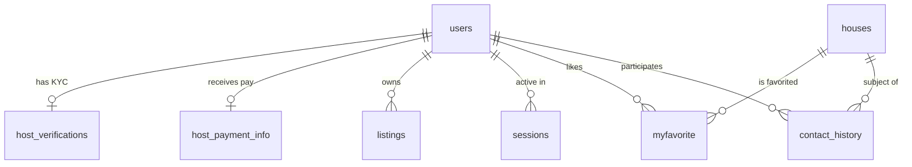

# 🗄️ Database Schema | House Renting Platform

The platform uses **PostgreSQL 15** to manage complex relationships between users, identity verification, property listings, and secure session management.

<div align="center">


[Overview](#-overview) • [Table Definitions](#-table-definitions) • [Relationships](#-entity-relationships) • [Setup Script](#-complete-setup-sql)

</div>

---

## 📊 Overview

The database is designed with a **Security-First** approach. It maintains a strict separation between public listing data (`houses`, `listings`) and sensitive host verification data (`host_verifications`, `host_payment_info`).

### Quick Stats

- **9 Core Tables**: Handling everything from KYC to real-time chat history.
- **Automated Logging**: `created_at` and `updated_at` timestamps on sensitive records.
- **Flexible Storage**: Utilizes `JSONB` for user history and property metadata.

---

## 🏗️ Table Definitions

### 1. users

The central authority for authentication and global verification status.

| Column      | Type         | Constraints         | Description                |
| ----------- | ------------ | ------------------- | -------------------------- |
| user_id     | INTEGER      | PRIMARY KEY, SERIAL | Internal unique ID         |
| email       | VARCHAR(150) | NOT NULL, UNIQUE    | User login identifier      |
| id_verified | BOOLEAN      | DEFAULT false       | Manual KYC approval status |
| is_host     | BOOLEAN      | DEFAULT false       | Elevates user permissions  |
| agreed_at   | TIMESTAMP    |                     | Step 6 Legal Timestamp     |

**SQL Snippet:**

```sql
CREATE TABLE users (
    user_id SERIAL PRIMARY KEY,
    user_name VARCHAR(100) NOT NULL,
    email VARCHAR(150) UNIQUE NOT NULL,
    hashed_password TEXT NOT NULL,
    salt TEXT NOT NULL,
    id_verified BOOLEAN NOT NULL DEFAULT false,
    is_host BOOLEAN NOT NULL DEFAULT false,
    agreed_terms BOOLEAN DEFAULT false,
    agreed_at TIMESTAMP,
    legal_right_confirmed BOOLEAN DEFAULT false
);
```

---

## 2. `host_verifications`

Stores encrypted paths to sensitive KYC documents _(Step 2)_.

| Column             | Type        | Constraints        | Description                        |
| ------------------ | ----------- | ------------------ | ---------------------------------- |
| `user_id`          | INTEGER     | UNIQUE, FK → users | One verification per user          |
| `id_photo_urls`    | TEXT[]      |                    | Array of ID card images            |
| `selfie_photo_url` | TEXT        |                    | Selfie with ID photo               |
| `auth_verified`    | BOOLEAN     | DEFAULT false      | Admin review flag                  |
| `host_role`        | VARCHAR(20) |                    | `owner`, `manager`, or `subletter` |
| `proof_doc_url`    | TEXT        |                    | Property ownership document        |
| `submitted_at`     | TIMESTAMP   | DEFAULT NOW()      | Submission timestamp               |
| `reviewed_at`      | TIMESTAMP   |                    | When admin reviewed                |
| `reviewed_by`      | INTEGER     | FK → users         | Admin user who reviewed            |
| `notes`            | TEXT        |                    | Admin rejection notes              |

---

## 3. `host_payment_info`

Financial routing details for host earnings _(Step 5)_.

| Column           | Type      | Constraints        | Description                               |
| ---------------- | --------- | ------------------ | ----------------------------------------- |
| `user_id`        | INTEGER   | UNIQUE, FK → users | Links payouts to identity                 |
| `account_name`   | TEXT      | NOT NULL           | Must match Verified ID                    |
| `bank_name`      | TEXT      | NOT NULL           | e.g. Chase, Barclays                      |
| `account_number` | TEXT      | NOT NULL           | IBAN or Account Number — stored encrypted |
| `verified`       | BOOLEAN   | DEFAULT false      | Admin approval flag                       |
| `created_at`     | TIMESTAMP | DEFAULT NOW()      | Record creation time                      |
| `updated_at`     | TIMESTAMP | DEFAULT NOW()      | Last updated time                         |

---

## 4. `houses` & `listings`

`houses` contains raw property data; `listings` contains the public marketing content.

| Table      | Purpose        | Key Columns                                        |
| ---------- | -------------- | -------------------------------------------------- |
| `houses`   | Physical specs | `price`, `category`, `img_url[]`, `details (JSON)` |
| `listings` | Public display | `title`, `description`, `property_type`, `address` |

---

## 5. Interaction Tables

Management of user engagement and security.

- **`myfavorite`** — Junction table for bookmarks. Unique constraint on `house_id` + `user_id`.
- **`contact_history`** — Tracks chat rooms between renters and hosts.
- **`sessions`** — Manages UUID-based secure sessions with `expires_at` logic.
- **`user_data`** — High-performance `JSONB` storage for browsing history.

---

## 🔗 Entity Relationships



---

## 🚀 Complete Setup SQL

> Run in this order to respect Foreign Key integrity.

```sql
-- ── 1. Base Tables ─────────────────────────────────────────────────────────

CREATE TABLE users (
    user_id               SERIAL PRIMARY KEY,
    user_name             VARCHAR(100) NOT NULL,
    email                 VARCHAR(150) UNIQUE NOT NULL,
    hashed_password       TEXT NOT NULL,
    salt                  TEXT NOT NULL,
    banned                BOOLEAN DEFAULT false,
    phone_number          VARCHAR(20),
    nationality           VARCHAR(100),
    email_verified        BOOLEAN NOT NULL DEFAULT false,
    phone_verified        BOOLEAN NOT NULL DEFAULT false,
    id_verified           BOOLEAN NOT NULL DEFAULT false,
    account_verified      VARCHAR(20) DEFAULT 'pending',
    is_host               BOOLEAN NOT NULL DEFAULT false,
    email_verify_token    TEXT,
    email_verify_expires  TIMESTAMP,
    country               VARCHAR(100),
    city                  VARCHAR(100),
    agreed_terms          BOOLEAN DEFAULT false,
    agreed_at             TIMESTAMP,
    legal_right_confirmed BOOLEAN DEFAULT false
);

CREATE TABLE houses (
    id            SERIAL PRIMARY KEY,
    category      VARCHAR(50),
    price         NUMERIC(10,2),
    location_name VARCHAR(255),
    location_url  VARCHAR(255),
    img_url       TEXT[],
    details       JSON
);

-- ── 2. Host Verification (KYC) ─────────────────────────────────────────────

CREATE TABLE host_verifications (
    id               SERIAL PRIMARY KEY,
    user_id          INTEGER UNIQUE REFERENCES users(user_id) ON DELETE CASCADE,
    id_photo_urls    TEXT[],
    selfie_photo_url TEXT,
    host_role        VARCHAR(20),   -- 'owner', 'manager', 'subletter'
    proof_doc_url    TEXT,
    auth_verified    BOOLEAN DEFAULT false,
    submitted_at     TIMESTAMP DEFAULT NOW(),
    reviewed_at      TIMESTAMP,
    reviewed_by      INTEGER,
    notes            TEXT
);

-- ── 3. Banking Info ────────────────────────────────────────────────────────

CREATE TABLE host_payment_info (
    id             SERIAL PRIMARY KEY,
    user_id        INTEGER UNIQUE REFERENCES users(user_id) ON DELETE CASCADE,
    account_name   TEXT NOT NULL,
    bank_name      TEXT NOT NULL,
    account_number TEXT NOT NULL,   -- stored encrypted (Fernet)
    verified       BOOLEAN DEFAULT false,
    created_at     TIMESTAMP DEFAULT NOW(),
    updated_at     TIMESTAMP DEFAULT NOW()
);

-- ── 4. Application Logic ───────────────────────────────────────────────────

CREATE TABLE listings (
    listing_id    SERIAL PRIMARY KEY,
    user_id       INTEGER REFERENCES users(user_id),
    title         VARCHAR(150),
    description   TEXT,
    property_type VARCHAR(50),
    address       TEXT
);

CREATE TABLE sessions (
    session_id UUID PRIMARY KEY,
    user_id    INTEGER NOT NULL REFERENCES users(user_id) ON DELETE CASCADE,
    created_at TIMESTAMP DEFAULT NOW(),
    expires_at TIMESTAMP
);

-- ── 5. Interaction Tables ──────────────────────────────────────────────────

CREATE TABLE myfavorite (
    id       SERIAL PRIMARY KEY,
    user_id  INTEGER REFERENCES users(user_id) ON DELETE CASCADE,
    house_id INTEGER REFERENCES houses(id) ON DELETE CASCADE,
    UNIQUE (user_id, house_id)
);

CREATE TABLE contact_history (
    id        SERIAL PRIMARY KEY,
    room_name VARCHAR(20) UNIQUE,
    house_id  INTEGER REFERENCES houses(id),
    user_id   INTEGER REFERENCES users(user_id),
    hoster_id INTEGER REFERENCES users(user_id),
    created_at TIMESTAMP DEFAULT NOW()
);
```

---

<div align="center">

[⬆ Back to Top](#️-houserent--database-schema-documentation)

</div>
