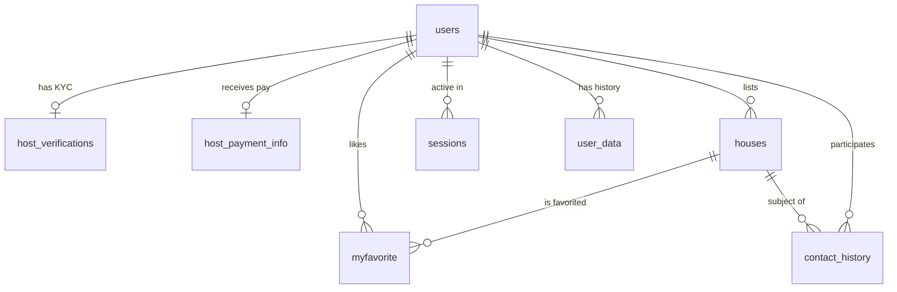

# 🗄️ Database Schema | HouseRent Platform

The platform uses **PostgreSQL 15** to manage complex relationships between users, identity verification, property listings, and secure session management.

<div align="center">


[Overview](#-overview) • [Table Definitions](#-table-definitions) • [Relationships](#-entity-relationships) • [Setup Script](#-complete-setup-sql)

</div>

---

## 📊 Overview

The database is designed with a **Security-First** approach. It maintains a strict separation between public listing data (`houses`) and sensitive host verification data (`host_verifications`, `host_payment_info`). Payment account numbers are stored encrypted using Fernet symmetric encryption.

### Quick Stats

- **8 Core Tables** — users, houses, host_verifications, host_payment_info, sessions, myfavorite, contact_history, user_data
- **Foreign Key Relationships** — 10+ constraints ensuring data integrity with CASCADE deletes
- **Flexible Storage** — `JSONB` for user history, `JSON` for house details, `TEXT[]` for image URL arrays
- **Encrypted Fields** — `account_number` in `host_payment_info` stored with Fernet encryption

---

## 🏗️ Table Definitions

### 1. `users`

The central authority for authentication, global verification status, and host onboarding progress.

| Column                  | Type         | Constraints         | Description                         |
| ----------------------- | ------------ | ------------------- | ----------------------------------- |
| `user_id`               | INTEGER      | PRIMARY KEY, SERIAL | Internal unique ID                  |
| `user_name`             | VARCHAR(100) | NOT NULL            | Display name                        |
| `email`                 | VARCHAR(150) | NOT NULL, UNIQUE    | Login identifier                    |
| `hashed_password`       | TEXT         | NOT NULL            | Salted hash                         |
| `salt`                  | TEXT         | NOT NULL            | Per-user salt                       |
| `banned`                | BOOLEAN      | DEFAULT false       | Account ban flag                    |
| `phone_number`          | VARCHAR(20)  |                     | Step 1 onboarding                   |
| `nationality`           | VARCHAR(100) |                     | Profile info                        |
| `country`               | VARCHAR(100) |                     | Step 1 onboarding                   |
| `city`                  | VARCHAR(100) |                     | Step 1 onboarding                   |
| `email_verified`        | BOOLEAN      | DEFAULT false       | Email confirmed                     |
| `phone_verified`        | BOOLEAN      | DEFAULT false       | Phone confirmed                     |
| `id_verified`           | BOOLEAN      | DEFAULT false       | KYC approved by admin               |
| `account_verified`      | VARCHAR(20)  | DEFAULT 'pending'   | `pending` / `approved` / `rejected` |
| `is_host`               | BOOLEAN      | DEFAULT false       | Host permission flag                |
| `is_admin`              | BOOLEAN      | DEFAULT false       | Admin permission flag               |
| `email_verify_token`    | TEXT         |                     | Active verification token           |
| `email_verify_expires`  | TIMESTAMP    |                     | Token expiry                        |
| `agreed_terms`          | BOOLEAN      | DEFAULT false       | Step 6 acceptance                   |
| `agreed_at`             | TIMESTAMP    |                     | Step 6 legal timestamp              |
| `legal_right_confirmed` | BOOLEAN      | DEFAULT false       | Property rights declaration         |

---

### 2. `host_verifications`

Stores file paths to sensitive KYC documents submitted during host onboarding (Steps 2 & 3).

| Column             | Type        | Constraints        | Description                        |
| ------------------ | ----------- | ------------------ | ---------------------------------- |
| `user_id`          | INTEGER     | UNIQUE, FK → users | One record per user                |
| `id_photo_urls`    | TEXT[]      |                    | Array of ID card image paths       |
| `selfie_photo_url` | TEXT        |                    | Selfie with ID path                |
| `host_role`        | VARCHAR(20) |                    | `owner`, `manager`, or `subletter` |
| `proof_doc_url`    | TEXT        |                    | Property authorization document    |
| `auth_verified`    | BOOLEAN     | DEFAULT false      | Admin approval flag                |
| `submitted_at`     | TIMESTAMP   | DEFAULT NOW()      | Submission time                    |
| `reviewed_at`      | TIMESTAMP   |                    | Admin review time                  |
| `reviewed_by`      | INTEGER     | FK → users         | Admin who reviewed                 |
| `notes`            | TEXT        |                    | Admin rejection reason             |

---

### 3. `host_payment_info`

Financial routing details for host payouts (Step 5). Account number is stored encrypted.

| Column           | Type      | Constraints        | Description               |
| ---------------- | --------- | ------------------ | ------------------------- |
| `user_id`        | INTEGER   | UNIQUE, FK → users | Links payouts to identity |
| `account_name`   | TEXT      | NOT NULL           | Must match verified ID    |
| `bank_name`      | TEXT      | NOT NULL           | e.g. Chase, Barclays      |
| `account_number` | TEXT      | NOT NULL           | Encrypted with Fernet     |
| `verified`       | BOOLEAN   | DEFAULT false      | Admin approval flag       |
| `created_at`     | TIMESTAMP | DEFAULT NOW()      | Record creation time      |
| `updated_at`     | TIMESTAMP | DEFAULT NOW()      | Last updated time         |

---

### 4. `houses`

Property listings with support for multiple images and flexible JSON details.

| Column          | Type          | Constraints         | Description                                 |
| --------------- | ------------- | ------------------- | ------------------------------------------- |
| `id`            | INTEGER       | PRIMARY KEY, SERIAL | Listing ID                                  |
| `category`      | VARCHAR(50)   |                     | `hotel`, `house`, `hostel`                  |
| `price`         | NUMERIC(15,2) |                     | Price per night/month                       |
| `location_name` | VARCHAR(255)  |                     | Human-readable address                      |
| `location_url`  | VARCHAR(255)  |                     | Google Maps link                            |
| `img_url`       | TEXT[]        |                     | Array of image paths                        |
| `details`       | JSON          |                     | `hoster_id`, `hoster_name`, `house_details` |

---

### 5. `sessions`

UUID-based session management with expiry for secure cookie authentication.

| Column       | Type      | Constraints          | Description                   |
| ------------ | --------- | -------------------- | ----------------------------- |
| `session_id` | UUID      | PRIMARY KEY          | Unique session token          |
| `user_id`    | INTEGER   | NOT NULL, FK → users | Session owner                 |
| `created_at` | TIMESTAMP | DEFAULT NOW()        | Session start                 |
| `expires_at` | TIMESTAMP |                      | Auto-extended on each request |

---

### 6. `myfavorite`

Junction table linking users to their bookmarked properties.

| Column     | Type    | Constraints               | Description            |
| ---------- | ------- | ------------------------- | ---------------------- |
| `id`       | INTEGER | PRIMARY KEY               | Row ID                 |
| `user_id`  | INTEGER | FK → users                | Bookmarking user       |
| `house_id` | INTEGER | FK → houses               | Bookmarked property    |
|            |         | UNIQUE(user_id, house_id) | No duplicate bookmarks |

---

### 7. `contact_history`

Tracks chat rooms created between renters and hosts.

| Column       | Type        | Constraints   | Description              |
| ------------ | ----------- | ------------- | ------------------------ |
| `id`         | INTEGER     | PRIMARY KEY   | Row ID                   |
| `room_name`  | VARCHAR(20) | UNIQUE        | Short random room code   |
| `house_id`   | INTEGER     | FK → houses   | Property being discussed |
| `user_id`    | INTEGER     | FK → users    | Renter in the room       |
| `hoster_id`  | INTEGER     | FK → users    | Host in the room         |
| `created_at` | TIMESTAMP   | DEFAULT NOW() | Room creation time       |

---

### 8. `user_data`

High-performance JSONB storage for user browsing history and activity.

| Column    | Type    | Constraints          | Description                |
| --------- | ------- | -------------------- | -------------------------- |
| `id`      | INTEGER | PRIMARY KEY          | Row ID                     |
| `user_id` | INTEGER | NOT NULL, FK → users | Data owner                 |
| `visited` | JSONB   | DEFAULT '[]'         | Array of visited house IDs |
| `history` | JSONB   | DEFAULT '{}'         | General activity history   |

---

## 🔗 Entity Relationships



---

## 🚀 Complete Setup SQL

> Run in this order to respect Foreign Key integrity.

```sql
-- ── 1. Users ───────────────────────────────────────────────────────────────

CREATE TABLE users (
    user_id               SERIAL PRIMARY KEY,
    user_name             VARCHAR(100) NOT NULL,
    email                 VARCHAR(150) UNIQUE NOT NULL,
    hashed_password       TEXT NOT NULL,
    salt                  TEXT NOT NULL,
    banned                BOOLEAN DEFAULT false,
    phone_number          VARCHAR(20),
    nationality           VARCHAR(100),
    email_verified        BOOLEAN NOT NULL DEFAULT false,
    phone_verified        BOOLEAN NOT NULL DEFAULT false,
    id_verified           BOOLEAN NOT NULL DEFAULT false,
    account_verified      VARCHAR(20) DEFAULT 'pending',
    is_host               BOOLEAN NOT NULL DEFAULT false,
    is_admin              BOOLEAN NOT NULL DEFAULT false,
    email_verify_token    TEXT,
    email_verify_expires  TIMESTAMP,
    country               VARCHAR(100),
    city                  VARCHAR(100),
    agreed_terms          BOOLEAN DEFAULT false,
    agreed_at             TIMESTAMP,
    legal_right_confirmed BOOLEAN DEFAULT false
);

-- ── 2. Houses ──────────────────────────────────────────────────────────────

CREATE TABLE houses (
    id            SERIAL PRIMARY KEY,
    category      VARCHAR(50),
    price         NUMERIC(15, 2),
    location_name VARCHAR(255),
    location_url  VARCHAR(255),
    img_url       TEXT[],
    details       JSON
);

-- ── 3. Host Verification (KYC) ─────────────────────────────────────────────

CREATE TABLE host_verifications (
    id               SERIAL PRIMARY KEY,
    user_id          INTEGER UNIQUE REFERENCES users(user_id) ON DELETE CASCADE,
    id_photo_urls    TEXT[],
    selfie_photo_url TEXT,
    host_role        VARCHAR(20),
    proof_doc_url    TEXT,
    auth_verified    BOOLEAN DEFAULT false,
    submitted_at     TIMESTAMP DEFAULT NOW(),
    reviewed_at      TIMESTAMP,
    reviewed_by      INTEGER REFERENCES users(user_id),
    notes            TEXT
);

-- ── 4. Payment Info ────────────────────────────────────────────────────────

CREATE TABLE host_payment_info (
    id             SERIAL PRIMARY KEY,
    user_id        INTEGER UNIQUE REFERENCES users(user_id) ON DELETE CASCADE,
    account_name   TEXT NOT NULL,
    bank_name      TEXT NOT NULL,
    account_number TEXT NOT NULL,
    verified       BOOLEAN DEFAULT false,
    created_at     TIMESTAMP DEFAULT NOW(),
    updated_at     TIMESTAMP DEFAULT NOW()
);

-- ── 5. Sessions ────────────────────────────────────────────────────────────

CREATE TABLE sessions (
    session_id UUID PRIMARY KEY,
    user_id    INTEGER NOT NULL REFERENCES users(user_id) ON DELETE CASCADE,
    created_at TIMESTAMP DEFAULT NOW(),
    expires_at TIMESTAMP
);

-- ── 6. Favourites ──────────────────────────────────────────────────────────

CREATE TABLE myfavorite (
    id       SERIAL PRIMARY KEY,
    user_id  INTEGER REFERENCES users(user_id) ON DELETE CASCADE,
    house_id INTEGER REFERENCES houses(id) ON DELETE CASCADE,
    UNIQUE (user_id, house_id)
);

-- ── 7. Contact / Chat Rooms ────────────────────────────────────────────────

CREATE TABLE contact_history (
    id         SERIAL PRIMARY KEY,
    room_name  VARCHAR(20) UNIQUE,
    house_id   INTEGER REFERENCES houses(id),
    user_id    INTEGER REFERENCES users(user_id),
    hoster_id  INTEGER REFERENCES users(user_id),
    created_at TIMESTAMP DEFAULT NOW()
);

-- ── 8. User Activity ───────────────────────────────────────────────────────

CREATE TABLE user_data (
    id       SERIAL PRIMARY KEY,
    user_id  INTEGER NOT NULL REFERENCES users(user_id) ON DELETE CASCADE,
    visited  JSONB DEFAULT '[]'::jsonb,
    history  JSONB DEFAULT '{}'::jsonb
);

-- ── Post-setup: make yourself admin ───────────────────────────────────────

-- UPDATE users SET is_admin = TRUE WHERE email = 'your@email.com';
```

---

<div align="center">

[⬆ Back to Top](#️-database-schema--houserent-platform)

</div>
